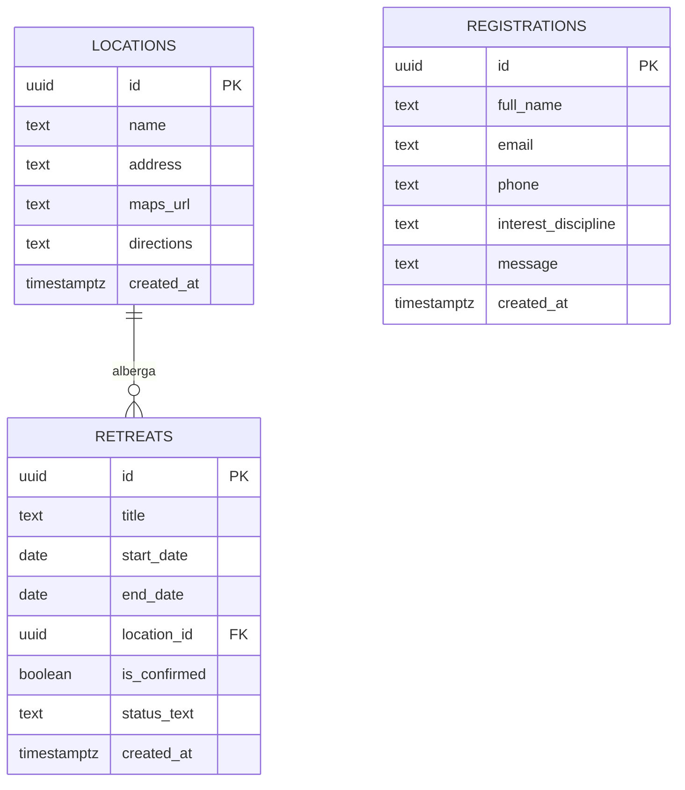
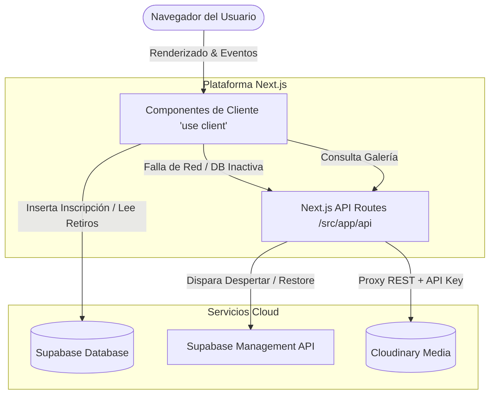
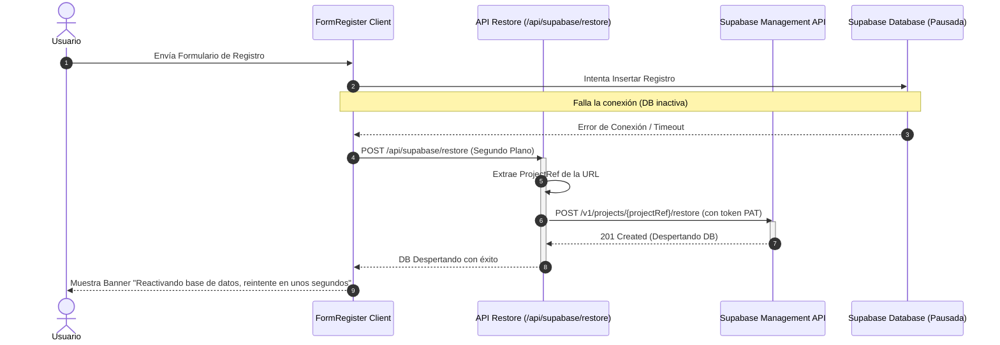

# Skill: Retiro Despertar Frontend Developer

Esta skill contiene las directrices, reglas de diseño, arquitectura de carpetas y lineamientos de negocio del proyecto **Retiro Despertar**.

## 📌 Guías y Referencias de Desarrollo

Para ver los detalles completos de cada área, consulta los documentos de referencia:

1. 🎯 **[Guía de Negocio y Objetivos (INSTRUCCIONES.md)]
# Guía de Arquitectura e Instrucciones del Proyecto (Retiro Despertar Frontend)

Este documento sirve como referencia tanto para **desarrolladores humanos** como para **agentes de IA** que necesiten entender, mantener o ampliar la estructura y lógica de esta aplicación.

---

## 1. Resumen del Proyecto

**Retiro Despertar** es una Landing Page moderna y premium para un retiro espiritual holístico, desarrollada con:
* **Next.js 15 (App Router)** en modo de salida `standalone` optimizado para contenedores Docker.
* **React 19 & TypeScript** para un tipado estricto y seguro.
* **Tailwind CSS** para un diseño adaptativo de alto rendimiento visual y móvil.
* **Supabase** como backend serverless para registros de usuarios y fechas programadas.
* **Cloudinary** para alojar de forma optimizada y dinámica el carrusel y la galería de fotos.

---

## 2. Estructura de la Base de Datos (Supabase)

El proyecto utiliza tres tablas principales en Supabase para registrar pre-inscripciones, definir ubicaciones físicas y planificar las fechas de los retiros. 

> [!IMPORTANT]
> Todas las tablas tienen habilitado **Row Level Security (RLS)** y cuentan con políticas que permiten la lectura pública (`SELECT`) de retiros y ubicaciones, mientras que los registros de pre-inscripción solo permiten inserciones públicas (`INSERT`) pero no lecturas desautorizadas.



### Tabla 1: `registrations` (Pre-inscripciones)
Almacena los datos enviados a través del formulario de reserva. Por seguridad, la lectura pública está bloqueada.

* **Estructura y Tipos:**
  * `id` (`UUID` - Primary Key, autogenerado): Identificador único del registro.
  * `full_name` (`TEXT` - Requerido): Nombre y apellido del interesado.
  * `email` (`TEXT` - Requerido): Correo electrónico de contacto.
  * `phone` (`TEXT` - Requerido): Teléfono con código de país.
  * `interest_discipline` (`TEXT` - Requerido): Disciplina por la que consulta (ej: *"Yoga"*, *"Reiki"*, *"Constelaciones"*, *"Todas"*).
  * `message` (`TEXT` - Opcional): Comentarios o dudas del usuario.
  * `created_at` (`TIMESTAMPTZ` - Default `now()`): Fecha y hora del registro.

* **Ejemplo Práctico de Datos:**
  ```json
  {
    "id": "a1b2c3d4-e5f6-7a8b-9c0d-1e2f3a4b5c6d",
    "full_name": "Sofía Giménez",
    "email": "sofia.gimenez@email.com",
    "phone": "5492215551234",
    "interest_discipline": "Constelaciones",
    "message": "Me gustaría reservar un cupo para agosto.",
    "created_at": "2026-07-16T15:00:00.000Z"
  }
  ```

---

### Tabla 2: `locations` (Ubicaciones de Retiros)
Evita la duplicación de ubicaciones físicas y almacena instrucciones específicas de cómo llegar y mapas de acceso.

* **Estructura y Tipos:**
  * `id` (`UUID` - Primary Key, autogenerado): Identificador único de la ubicación.
  * `name` (`TEXT` - Requerido): Nombre del complejo u hotel (ej: *"Complejo Minahasa"*).
  * `address` (`TEXT` - Requerido): Dirección o zona geográfica visible (ej: *"Tigre, Buenos Aires (Delta)"*).
  * `maps_url` (`TEXT` - Requerido): Enlace absoluto de redirección a Google Maps.
  * `directions` (`TEXT` - Opcional): Instrucciones paso a paso para el viajero (ej: lanchas, rutas).
  * `created_at` (`TIMESTAMPTZ` - Default `now()`): Fecha de registro de la ubicación.

* **Ejemplo Práctico de Datos:**
  ```json
  {
    "id": "11111111-1111-1111-1111-111111111111",
    "name": "Complejo Minahasa",
    "address": "Tigre, Buenos Aires (Delta)",
    "maps_url": "https://maps.app.goo.gl/d9Z1w2x3y4z5a6b7c",
    "directions": "Se llega mediante lancha colectiva 'Línea Interisleña' desde la Estación Fluvial de Tigre (Muelle 1).",
    "created_at": "2026-07-16T12:00:00.000Z"
  }
  ```

---

### Tabla 3: `retreats` (Fechas Programadas)
Mantiene el calendario de retiros futuros. Se consulta en la sección de "Próximos Retiros".

* **Estructura y Tipos:**
  * `id` (`UUID` - Primary Key, autogenerado): Identificador único del retiro.
  * `title` (`TEXT` - Requerido): Nombre descriptivo del retiro.
  * `start_date` (`DATE` - Requerido): Fecha en la que inicia (ej: `2026-08-01`).
  * `end_date` (`DATE` - Requerido): Fecha en la que finaliza (ej: `2026-08-02`).
  * `location_id` (`UUID` - Foreign Key, apunta a `locations(id)`): Ubicación asignada al retiro.
  * `is_confirmed` (`BOOLEAN` - Default `true`): Bandera para indicar si la fecha está firme (`true`) o pendiente de confirmación (`false`).
  * `status_text` (`TEXT` - Opcional): Mensaje personalizado si no está confirmado (ej: *"Próximamente confirmamos"*).
  * `created_at` (`TIMESTAMPTZ` - Default `now()`): Fecha de creación del registro.

* **Ejemplo Práctico de Datos:**
  ```json
  {
    "id": "8c7b6a5f-4d3c-2b1a-0f9e-8d7c6b5a4f3e",
    "title": "Retiro Despertar - Conexión Delta",
    "start_date": "2026-08-01",
    "end_date": "2026-08-02",
    "location_id": "11111111-1111-1111-1111-111111111111",
    "is_confirmed": true,
    "status_text": null,
    "created_at": "2026-07-16T12:05:00.000Z"
  }
  ```

---

## 3. Integración Multimedia (Cloudinary)

La visualización de imágenes y galerías se hace dinámicamente mediante el endpoint `/api/gallery`:
* **Por Tag**: Para secciones temáticas ("Gastronomía", "Actividades"), consulta la lista de recursos JSON de Cloudinary: `https://res.cloudinary.com/{cloudName}/image/list/{tag}.json`.
* **Por Carpeta (Ubicaciones)**: Para explorar las carpetas físicas de imágenes sin usar mocks, se consulta el SDK de administración o la API de listados filtrando por el path relativo.
* **Optimización**: Las URLs resultantes se generan usando transformaciones inteligentes (`f_auto,q_auto`) para minimizar el peso de carga en dispositivos móviles.

---

## 4. Mecanismo de Despertar Automático (Auto-Restore de Supabase)

Debido a que las instancias gratuitas de Supabase pueden pausarse tras un periodo de inactividad de más de 2 días, implementamos una rutina de auto-recuperación:
1. Al fallar una llamada de guardado en el formulario de inscripción (`FormRegister.tsx`), el cliente invoca al endpoint `/api/supabase/restore` (POST) en segundo plano.
2. El endpoint lee la variable de entorno `SUPABASE_MANAGEMENT_PAT` y extrae la referencia del proyecto de `NEXT_PUBLIC_SUPABASE_URL`.
3. Llama a la API de administración de Supabase (`https://api.supabase.com/v1/projects/{projectRef}/restore`) para despertar el servicio de forma programática.
4. Se le notifica al usuario final mediante un banner amigable que la base de datos se está reactivando y se le solicita reintentar el envío en unos segundos.

---

## 5. Instrucciones para Desarrollo y Agentes de IA

### Paso a Paso para Iniciar el Proyecto

1. **Clonar e Instalar**:
   Clona el repositorio en tu espacio de trabajo y ejecuta la instalación de dependencias:
   ```bash
   npm install
   ```

2. **Establecer Variables de Entorno**:
   Copia el archivo de ejemplo para crear tu archivo local:
   ```bash
   cp .env.local.example .env.local
   ```
   Completa los valores de `SUPABASE_*` y `CLOUDINARY_*` con tus credenciales.

3. **Iniciar Estructura de Base de Datos**:
   Ejecuta las consultas DDL de [create_retreats_table.sql](create_retreats_table.sql) en el **SQL Editor** de Supabase para inicializar las tablas `locations` y `retreats`, sus relaciones y políticas RLS.

4. **Lanzar Servidor de Desarrollo**:
   Corre el servidor de desarrollo local:
   ```bash
   npm run dev
   ```
   Visita la web en [http://localhost:3000](http://localhost:3000).

5. **Levantar Producción con Docker**:
   Construye la imagen optimizada `standalone` y despliega localmente:
   ```bash
   docker-compose up --build
   ```

### Comandos Clave del Proyecto
* Iniciar servidor de desarrollo: `npm run dev`
* Comprobación estática de tipos: `npx tsc --noEmit`
* Construcción estática de producción: `npm run build`

### Lineamientos de Estilo
El diseño visual debe seguir una estética premium, pacífica y zen:
* **Tipografía**: Títulos con fuente Serif elegante (`Playfair Display`) y textos de lectura Sans-Serif limpia (`Inter`).
* **Paleta**: Colores orgánicos con fondos piedra/arena (`stone-50`), textos carbón (`stone-800`), acentos esmeralda y verde bosque (`emerald-800`, `emerald-900`) y notas sutiles de madera/tierra.
* **Enfoque Mobile-First**: Todo componente visual debe ser totalmente adaptable a pantallas pequeñas y soportar gestos táctiles.

   - Foco en Constelaciones Familiares, Reiki y Yoga.
   - Look & Feel orgánico, tonos tierra suaves, verdes secos y beige.
2. 📐 **[Estructura y Arquitectura (ARCHITECTURE.md)]
# Documento de Arquitectura - Retiro Despertar Frontend

Este documento proporciona una visión general técnica de la arquitectura de software del frontend de **Retiro Despertar**, detallando la organización del código, los flujos de datos, la seguridad y las integraciones con servicios de terceros.

---

## 1. Patrón Arquitectónico General

La plataforma adopta el patrón **Jamstack / SPA** impulsado por **Next.js 15 (App Router)**. Combina generación de componentes en el servidor (para optimización de velocidad de carga y SEO) con componentes interactivos en el navegador.



---

## 2. Organización del Directorio

El proyecto sigue una estructura limpia típica de Next.js:

*   **`src/app/`**: Enrutador del framework.
    *   `layout.tsx`: Cabecera común, fuentes integradas de Google y widget flotante de WhatsApp.
    *   `page.tsx`: Contenedor de la página de inicio (Landing Page) que ordena las secciones principales.
    *   `galeria/`: Página de visualización multimedia con Lazy Loading integrado.
    *   `api/`: Rutas de backend/servidor que actúan como proxies seguros.
        *   `api/gallery/route.ts`: Consulta de listados públicos de Cloudinary.
        *   `api/supabase/restore/route.ts`: Despierta la base de datos de Supabase si está pausada.
*   **`src/components/`**: Módulos de UI reutilizables (carruseles, formularios, botones).
*   **`src/lib/`**: Inicialización de clientes SDK (ej: el cliente de Supabase en `supabase.ts`).
*   **`docs/`**: Contiene especificaciones técnicas, archivos de semilla SQL e instrucciones de inicio.

---

## 3. Seguridad y Manejo de Entornos

Para mantener la plataforma segura, dividimos las variables de entorno en dos categorías (según las convenciones de Next.js):

1.  **Exposición Segura al Cliente (`NEXT_PUBLIC_`)**:
    *   Variables como `NEXT_PUBLIC_SUPABASE_URL` y `NEXT_PUBLIC_SUPABASE_ANON_KEY` se compilan dentro del bundle de JavaScript. Son seguras porque Supabase utiliza políticas de seguridad a nivel de base de datos.
    *   `NEXT_PUBLIC_WHATSAPP_NUMBER` se expone para construir el enlace en el navegador.
2.  **Secretos de Servidor (Sin prefijo)**:
    *   Las credenciales de Cloudinary (`CLOUDINARY_CLIENT_SECRET`) y el Token de Supabase (`SUPABASE_MANAGEMENT_PAT`) **nunca** se envían al cliente. Se consultan exclusivamente en las API Routes (`/src/app/api/...`), protegiendo el sistema de accesos no autorizados.

---

## 4. Flujo de Datos e Integración de Supabase

El sistema interactúa con Supabase para dos flujos clave:

### A. Consulta de Retiros Programados
El componente `UpcomingRetreats` consulta las fechas en tiempo real ordenadas cronológicamente y omitiendo fechas pasadas:
1.  El cliente realiza un query relacional `.select('*, locations(*)')` filtrando `end_date >= hoy`.
2.  Se renderiza el retiro activo más próximo en grande con una cuenta regresiva.
3.  Los retiros sin confirmar muestran la etiqueta *"Próximamente confirmamos"*.

### B. Registro e Inscripciones
1.  El usuario envía sus datos de contacto en `FormRegister.tsx`.
2.  Los datos se insertan directamente en la tabla `registrations` mediante el SDK de Supabase.
3.  **Seguridad RLS (Row Level Security)**: La tabla `registrations` tiene una política que permite únicamente la inserción pública (`INSERT`). Nadie ajeno a la administración puede leer (`SELECT`), actualizar o borrar registros de otros usuarios, asegurando la privacidad de datos sensibles.

---

## 5. Arquitectura de Resiliencia: Supabase Auto-Restore

Debido a que las instancias de Supabase del tier gratuito entran en pausa tras 2 días sin actividad, implementamos un sistema de autorecuperación automática ante fallas de base de datos:



   - Arquitectura modular basada en Next.js App Router.
   - Organización de componentes visuales de presentación y lógica.
3.# Skill: Diseño Frontend Moderno, Mobile-First y Experiencia de Usuario Holística

Esta guía define las reglas de diseño, maquetación y estilizado que debe seguir la inteligencia artificial y el desarrollador al construir interfaces para este proyecto. El objetivo es lograr una UI pulida, fluida y con un rendimiento excepcional.

## 1. Filosofía Mobile-First Absoluta

El desarrollo se realiza pensando en el dispositivo móvil como la pantalla principal, escalando progresivamente hacia monitores de escritorio.

- **Regla de Escritura de Clases:** Las clases base de Tailwind CSS se aplican directamente al móvil sin prefijos (ej. `p-4`, `text-xl`, `flex-col`, `w-full`).
- **Escalabilidad Progresiva:** Los breakpoints se usan exclusivamente para reordenar o expandir el diseño en pantallas grandes (ej. `md:p-8`, `md:text-3xl`, `md:flex-row`).
- **Contenedores de Escritorio:** Para evitar que la landing page se estire infinitamente en monitores anchos, el contenedor principal de la página siempre debe llevar un límite de ancho máximo y estar centrado: `max-w-7xl mx-auto px-4 sm:px-6 lg:px-8`.

## 2. Identidad Visual y Look & Feel (Retiros Espirituales)

Para transmitir bienestar, paz y introspección (Yoga, Reiki, Constelaciones), se utilizará una estética orgánica y minimalista.

- **Paleta de Colores Teórica (Basada en Tailwind):**
  - *Fondos:* Tonos cálidos y suaves (`bg-stone-50`, `bg-amber-50/40`, `bg-white`). Evitar grises fríos o negros puros.
  - *Textos:* Alta legibilidad pero suaves al ojo (`text-stone-800` para títulos principales, `text-stone-600` para descripciones).
  - *Acentos (Naturaleza/Energía):* Verdes secos, lavandas o dorados apagados (`text-emerald-800`, `bg-emerald-700`, `text-amber-700`).
- **Formas y Sombras:**
  - Bordes muy suavizados para dar sensación de amabilidad: `rounded-2xl` o `rounded-3xl` en tarjetas y carruseles.
  - Sombras imperceptibles y limpias: `shadow-sm` o `shadow-md/50` mezcladas con bordes sutiles `border border-stone-100`.

## 3. Manejo de Imágenes y Layouts Responsivos

Las imágenes son el núcleo emocional del sitio y deben verse perfectas en cualquier resolución.

- **Fórmula de Imagen Responsiva Impecable (Next.js):**
  Para que una foto llene su espacio en móvil y escritorio sin deformarse ni estirarse, el componente `<Image />` siempre debe seguir este patrón estructural:
  ```tsx
  <div className="relative w-full aspect-square md:aspect-video rounded-2xl overflow-hidden">
    <Image alt="Descripción" className="object-cover" fill priority={isHero} src="/images/tu-foto.jpg"/>
  </div>
  ```

   - Enfoque Mobile-First absoluto con Tailwind CSS.
   - Contenedores de escritorio limitados (`max-w-7xl mx-auto px-4 sm:px-6 lg:px-8`).
   - Manejo responsivo y estético de imágenes usando `<Image />` con `fill` y contenedores con `aspect-ratio`.

## ⚙️ Reglas de Implementación Obligatorias

- **Mobile-First:** Las clases base de Tailwind CSS se aplican directamente al móvil sin prefijos. Los breakpoints (`md:`, `lg:`) se reservan para pantallas grandes.
- **Identidad Visual:** Utilizar tonos cálidos (`bg-stone-50`, `bg-amber-50/40`), textos legibles pero suaves (`text-stone-800`), formas redondeadas (`rounded-2xl` o `rounded-3xl`) y sombras sutiles.
- **Rendimiento:** Cargar imágenes críticas con `priority` y optimizarlas adecuadamente.
- **Sin Mocks de Datos:** En el caso que sea necesario simular datos de prueba, se deben utilizar archivos JSON dentro de la carpeta `data` y mockear las respuestas en los servidores serverless.
- **Seguridad en Formularios (RLS):** Toda inserción de datos personales (como en `registrations`) debe respetar la política RLS en Supabase: permitir inserción pública (`INSERT`) pero restringir lectura pública (`SELECT`).
- **Manejo de Resiliencia (Auto-Restore):** Si una transacción a Supabase falla en el cliente (debido a la pausa de inactividad de 2 días del tier gratuito), el código debe invocar el endpoint POST `/api/supabase/restore` para despertar el proyecto y solicitar de forma amigable al usuario que reintente en unos segundos.
- **Responsabilidad Única y Flujos Declarativos:** Las funciones deben tener una única responsabilidad clara. Para evitar estructuras extensas de `if-else` o `switch` repetitivos, se debe favorecer el uso del **Patrón de Estrategia (Strategy / Dispatch Maps)** mapeando condiciones o claves directamente a funciones ejecutoras, manteniendo el código limpio y declarativo.

## Estrategia y Directrices de Testing Unitario

Para asegurar la robustez de la aplicación y prevenir fallas críticas en producción:

### Reglas Obligatorias:
1.  **Cobertura Lógica Completa:** No se permite escribir código de lógica core (como helpers de formato, utilidades de carrito, custom hooks o flujos de cotización) sin sus respectivos tests unitarios.
2.  **Casos de Uso del Mundo Real:** Los tests no deben ser redundantes ni limitarse a verificar tipos; deben modelar comportamientos reales del usuario (ej. agregar cantidades de a 6, vaciar la bolsa, validar talle seleccionado).
3.  **Prevención de Brechas (Gaps):** Probar exhaustivamente caminos alternativos y excepciones (ej. inputs numéricos negativos, datos de contacto vacíos o desconexiones locales).

### Aspectos Adicionales a Contemplar:
*   **Sincronización con LocalStorage:** Probar que el estado del carrito persista correctamente tras operaciones de guardado y se recupere intacto al iniciar la app.
*   **Mocks de Next.js:** Mockear utilidades nativas de navegación (`usePathname`, `useRouter`, `<Image />`, `<Link />`) para aislar los tests de integración del framework.
*   **Validación de URLs de Despacho:** Asegurar que la URL generada para WhatsApp contenga los parámetros codificados correspondientes y respete el formato de texto plano sin alterar los artículos.
