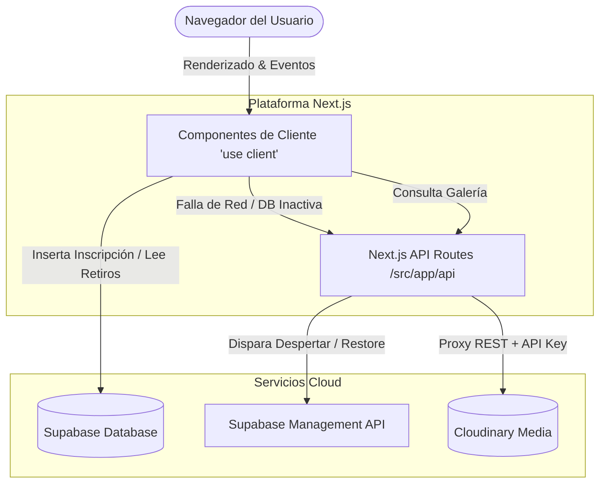
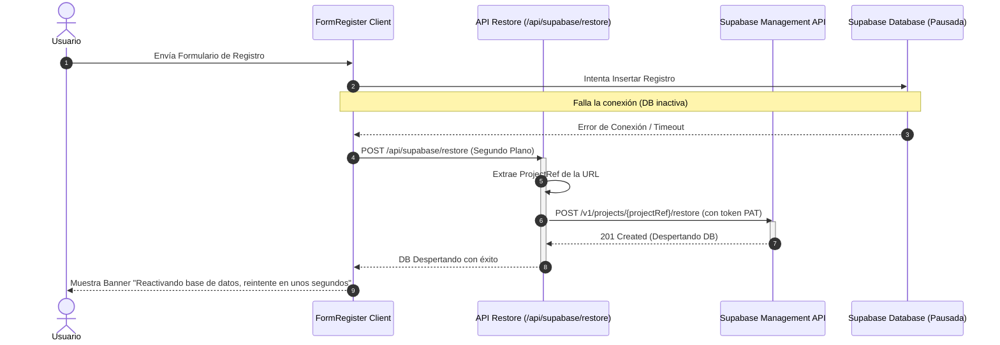

# Documento de Arquitectura - Retiro Despertar Frontend

Este documento proporciona una visión general técnica de la arquitectura de software del frontend de **Retiro Despertar**, detallando la organización del código, los flujos de datos, la seguridad y las integraciones con servicios de terceros.

---

## 1. Patrón Arquitectónico General

La plataforma adopta el patrón **Jamstack / SPA** impulsado por **Next.js 15 (App Router)**. Combina generación de componentes en el servidor (para optimización de velocidad de carga y SEO) con componentes interactivos en el navegador.

---

## 2. Organización del Directorio

El proyecto sigue una estructura limpia típica de Next.js:

*   **`src/app/`**: Enrutador del framework.
    *   `layout.tsx`: Cabecera común, fuentes integradas de Google y widget flotante de WhatsApp.
    *   `page.tsx`: Contenedor de la página de inicio (Landing Page) que ordena las secciones principales.
    *   `galeria/`: Página de visualización multimedia con Lazy Loading integrado.
    *   `api/`: Rutas de backend/servidor que actúan como proxies seguros.
        *   `api/gallery/route.ts`: Consulta de listados públicos de Cloudinary.
        *   `api/supabase/restore/route.ts`: Despierta la base de datos de Supabase si está pausada.
*   **`src/components/`**: Módulos de UI reutilizables (carruseles, formularios, botones).
*   **`src/lib/`**: Inicialización de clientes SDK (ej: el cliente de Supabase en `supabase.ts`).
*   **`docs/`**: Contiene especificaciones técnicas, archivos de semilla SQL e instrucciones de inicio.

---

## 3. Seguridad y Manejo de Entornos

Para mantener la plataforma segura, dividimos las variables de entorno en dos categorías (según las convenciones de Next.js):

1.  **Exposición Segura al Cliente (`NEXT_PUBLIC_`)**:
    *   Variables como `NEXT_PUBLIC_SUPABASE_URL` y `NEXT_PUBLIC_SUPABASE_ANON_KEY` se compilan dentro del bundle de JavaScript. Son seguras porque Supabase utiliza políticas de seguridad a nivel de base de datos.
    *   `NEXT_PUBLIC_WHATSAPP_NUMBER` se expone para construir el enlace en el navegador.
2.  **Secretos de Servidor (Sin prefijo)**:
    *   Las credenciales de Cloudinary (`CLOUDINARY_CLIENT_SECRET`) y el Token de Supabase (`SUPABASE_MANAGEMENT_PAT`) **nunca** se envían al cliente. Se consultan exclusivamente en las API Routes (`/src/app/api/...`), protegiendo el sistema de accesos no autorizados.

---

## 4. Flujo de Datos e Integración de Supabase

El sistema interactúa con Supabase para dos flujos clave:

### A. Consulta de Retiros Programados
El componente `UpcomingRetreats` consulta las fechas en tiempo real ordenadas cronológicamente y omitiendo fechas pasadas:
1.  El cliente realiza un query relacional `.select('*, locations(*)')` filtrando `end_date >= hoy`.
2.  Se renderiza el retiro activo más próximo en grande con una cuenta regresiva.
3.  Los retiros sin confirmar muestran la etiqueta *"Próximamente confirmamos"*.

### B. Registro e Inscripciones
1.  El usuario envía sus datos de contacto en `FormRegister.tsx`.
2.  Los datos se insertan directamente en la tabla `registrations` mediante el SDK de Supabase.
3.  **Seguridad RLS (Row Level Security)**: La tabla `registrations` tiene una política que permite únicamente la inserción pública (`INSERT`). Nadie ajeno a la administración puede leer (`SELECT`), actualizar o borrar registros de otros usuarios, asegurando la privacidad de datos sensibles.

---

## 5. Arquitectura de Resiliencia: Supabase Auto-Restore

Debido a que las instancias de Supabase del tier gratuito entran en pausa tras 2 días sin actividad, implementamos un sistema de autorecuperación automática ante fallas de base de datos:

