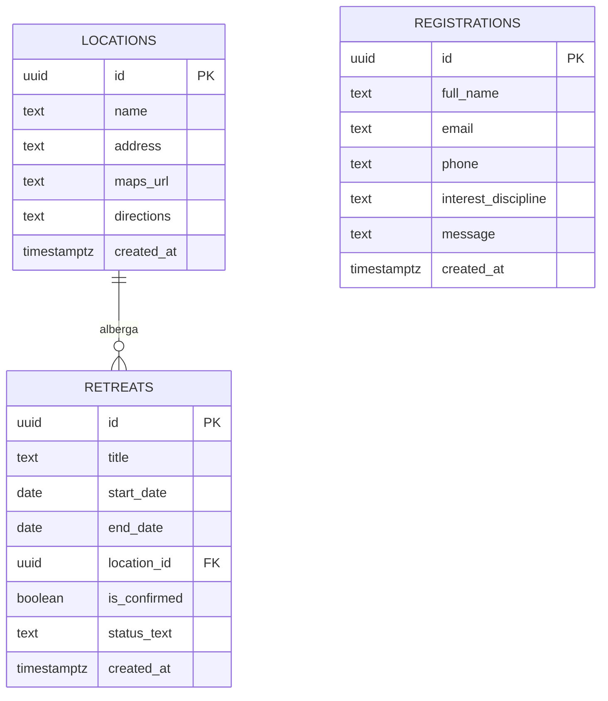

# Guía de Arquitectura e Instrucciones del Proyecto (Retiro Despertar Frontend)

Este documento sirve como referencia tanto para **desarrolladores humanos** como para **agentes de IA** que necesiten entender, mantener o ampliar la estructura y lógica de esta aplicación.

---

## 1. Resumen del Proyecto

**Retiro Despertar** es una Landing Page moderna y premium para un retiro espiritual holístico, desarrollada con:
* **Next.js 15 (App Router)** en modo de salida `standalone` optimizado para contenedores Docker.
* **React 19 & TypeScript** para un tipado estricto y seguro.
* **Tailwind CSS** para un diseño adaptativo de alto rendimiento visual y móvil.
* **Supabase** como backend serverless para registros de usuarios y fechas programadas.
* **Cloudinary** para alojar de forma optimizada y dinámica el carrusel y la galería de fotos.

---

## 2. Estructura de la Base de Datos (Supabase)

El proyecto utiliza tres tablas principales en Supabase para registrar pre-inscripciones, definir ubicaciones físicas y planificar las fechas de los retiros. 

> [!IMPORTANT]
> Todas las tablas tienen habilitado **Row Level Security (RLS)** y cuentan con políticas que permiten la lectura pública (`SELECT`) de retiros y ubicaciones, mientras que los registros de pre-inscripción solo permiten inserciones públicas (`INSERT`) pero no lecturas desautorizadas.



### Tabla 1: `registrations` (Pre-inscripciones)
Almacena los datos enviados a través del formulario de reserva. Por seguridad, la lectura pública está bloqueada.

* **Estructura y Tipos:**
  * `id` (`UUID` - Primary Key, autogenerado): Identificador único del registro.
  * `full_name` (`TEXT` - Requerido): Nombre y apellido del interesado.
  * `email` (`TEXT` - Requerido): Correo electrónico de contacto.
  * `phone` (`TEXT` - Requerido): Teléfono con código de país.
  * `interest_discipline` (`TEXT` - Requerido): Disciplina por la que consulta (ej: *"Yoga"*, *"Reiki"*, *"Constelaciones"*, *"Todas"*).
  * `message` (`TEXT` - Opcional): Comentarios o dudas del usuario.
  * `created_at` (`TIMESTAMPTZ` - Default `now()`): Fecha y hora del registro.

* **Ejemplo Práctico de Datos:**
  ```json
  {
    "id": "a1b2c3d4-e5f6-7a8b-9c0d-1e2f3a4b5c6d",
    "full_name": "Sofía Giménez",
    "email": "sofia.gimenez@email.com",
    "phone": "5492215551234",
    "interest_discipline": "Constelaciones",
    "message": "Me gustaría reservar un cupo para agosto.",
    "created_at": "2026-07-16T15:00:00.000Z"
  }
  ```

---

### Tabla 2: `locations` (Ubicaciones de Retiros)
Evita la duplicación de ubicaciones físicas y almacena instrucciones específicas de cómo llegar y mapas de acceso.

* **Estructura y Tipos:**
  * `id` (`UUID` - Primary Key, autogenerado): Identificador único de la ubicación.
  * `name` (`TEXT` - Requerido): Nombre del complejo u hotel (ej: *"Complejo Minahasa"*).
  * `address` (`TEXT` - Requerido): Dirección o zona geográfica visible (ej: *"Tigre, Buenos Aires (Delta)"*).
  * `maps_url` (`TEXT` - Requerido): Enlace absoluto de redirección a Google Maps.
  * `directions` (`TEXT` - Opcional): Instrucciones paso a paso para el viajero (ej: lanchas, rutas).
  * `created_at` (`TIMESTAMPTZ` - Default `now()`): Fecha de registro de la ubicación.

* **Ejemplo Práctico de Datos:**
  ```json
  {
    "id": "11111111-1111-1111-1111-111111111111",
    "name": "Complejo Minahasa",
    "address": "Tigre, Buenos Aires (Delta)",
    "maps_url": "https://maps.app.goo.gl/d9Z1w2x3y4z5a6b7c",
    "directions": "Se llega mediante lancha colectiva 'Línea Interisleña' desde la Estación Fluvial de Tigre (Muelle 1).",
    "created_at": "2026-07-16T12:00:00.000Z"
  }
  ```

---

### Tabla 3: `retreats` (Fechas Programadas)
Mantiene el calendario de retiros futuros. Se consulta en la sección de "Próximos Retiros".

* **Estructura y Tipos:**
  * `id` (`UUID` - Primary Key, autogenerado): Identificador único del retiro.
  * `title` (`TEXT` - Requerido): Nombre descriptivo del retiro.
  * `start_date` (`DATE` - Requerido): Fecha en la que inicia (ej: `2026-08-01`).
  * `end_date` (`DATE` - Requerido): Fecha en la que finaliza (ej: `2026-08-02`).
  * `location_id` (`UUID` - Foreign Key, apunta a `locations(id)`): Ubicación asignada al retiro.
  * `is_confirmed` (`BOOLEAN` - Default `true`): Bandera para indicar si la fecha está firme (`true`) o pendiente de confirmación (`false`).
  * `status_text` (`TEXT` - Opcional): Mensaje personalizado si no está confirmado (ej: *"Próximamente confirmamos"*).
  * `created_at` (`TIMESTAMPTZ` - Default `now()`): Fecha de creación del registro.

* **Ejemplo Práctico de Datos:**
  ```json
  {
    "id": "8c7b6a5f-4d3c-2b1a-0f9e-8d7c6b5a4f3e",
    "title": "Retiro Despertar - Conexión Delta",
    "start_date": "2026-08-01",
    "end_date": "2026-08-02",
    "location_id": "11111111-1111-1111-1111-111111111111",
    "is_confirmed": true,
    "status_text": null,
    "created_at": "2026-07-16T12:05:00.000Z"
  }
  ```

---

## 3. Integración Multimedia (Cloudinary)

La visualización de imágenes y galerías se hace dinámicamente mediante el endpoint `/api/gallery`:
* **Por Tag**: Para secciones temáticas ("Gastronomía", "Actividades"), consulta la lista de recursos JSON de Cloudinary: `https://res.cloudinary.com/{cloudName}/image/list/{tag}.json`.
* **Por Carpeta (Ubicaciones)**: Para explorar las carpetas físicas de imágenes sin usar mocks, se consulta el SDK de administración o la API de listados filtrando por el path relativo.
* **Optimización**: Las URLs resultantes se generan usando transformaciones inteligentes (`f_auto,q_auto`) para minimizar el peso de carga en dispositivos móviles.

---

## 4. Mecanismo de Despertar Automático (Auto-Restore de Supabase)

Debido a que las instancias gratuitas de Supabase pueden pausarse tras un periodo de inactividad de más de 2 días, implementamos una rutina de auto-recuperación:
1. Al fallar una llamada de guardado en el formulario de inscripción (`FormRegister.tsx`), el cliente invoca al endpoint `/api/supabase/restore` (POST) en segundo plano.
2. El endpoint lee la variable de entorno `SUPABASE_MANAGEMENT_PAT` y extrae la referencia del proyecto de `NEXT_PUBLIC_SUPABASE_URL`.
3. Llama a la API de administración de Supabase (`https://api.supabase.com/v1/projects/{projectRef}/restore`) para despertar el servicio de forma programática.
4. Se le notifica al usuario final mediante un banner amigable que la base de datos se está reactivando y se le solicita reintentar el envío en unos segundos.

---

## 5. Instrucciones para Desarrollo y Agentes de IA

### Paso a Paso para Iniciar el Proyecto

1. **Clonar e Instalar**:
   Clona el repositorio en tu espacio de trabajo y ejecuta la instalación de dependencias:
   ```bash
   npm install
   ```

2. **Establecer Variables de Entorno**:
   Copia el archivo de ejemplo para crear tu archivo local:
   ```bash
   cp .env.local.example .env.local
   ```
   Completa los valores de `SUPABASE_*` y `CLOUDINARY_*` con tus credenciales.

3. **Iniciar Estructura de Base de Datos**:
   Ejecuta las consultas DDL de [create_retreats_table.sql](create_retreats_table.sql) en el **SQL Editor** de Supabase para inicializar las tablas `locations` y `retreats`, sus relaciones y políticas RLS.

4. **Lanzar Servidor de Desarrollo**:
   Corre el servidor de desarrollo local:
   ```bash
   npm run dev
   ```
   Visita la web en [http://localhost:3000](http://localhost:3000).

5. **Levantar Producción con Docker**:
   Construye la imagen optimizada `standalone` y despliega localmente:
   ```bash
   docker-compose up --build
   ```

### Comandos Clave del Proyecto
* Iniciar servidor de desarrollo: `npm run dev`
* Comprobación estática de tipos: `npx tsc --noEmit`
* Construcción estática de producción: `npm run build`

### Lineamientos de Estilo
El diseño visual debe seguir una estética premium, pacífica y zen:
* **Tipografía**: Títulos con fuente Serif elegante (`Playfair Display`) y textos de lectura Sans-Serif limpia (`Inter`).
* **Paleta**: Colores orgánicos con fondos piedra/arena (`stone-50`), textos carbón (`stone-800`), acentos esmeralda y verde bosque (`emerald-800`, `emerald-900`) y notas sutiles de madera/tierra.
* **Enfoque Mobile-First**: Todo componente visual debe ser totalmente adaptable a pantallas pequeñas y soportar gestos táctiles.
